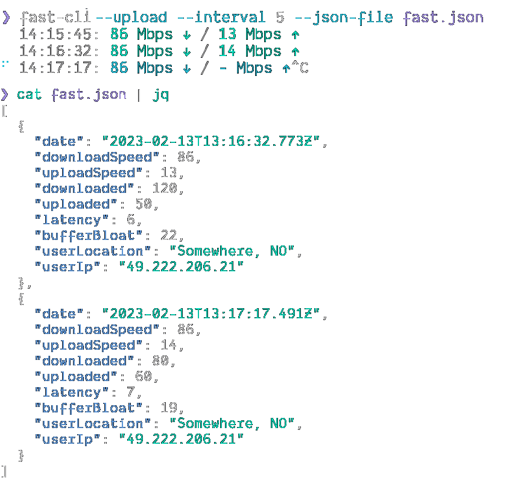

# fast-cli

> Test your download and upload speed using [fast.com](https://fast.com)


## Install

Ensure you have [Node.js](https://nodejs.org) version 14+ installed. Then run the following:

```sh
npm install --global fast-cli
```

_This project uses Puppeteer under the hood. Most [install issues](https://github.com/puppeteer/puppeteer/blob/main/docs/troubleshooting.md) are related to that._

## Usage

```
$ fast --help

  Usage
    $ fast [options]

	Options
    --debug            Show cli options information
    --interval, -i     Bandwidth interval test (in minutes)
    --json             JSON output
    --json-file, -o    Output to json file
    --single-line, -s  Reduce spacing and output to a single line
    --upload, -u       Disable upload speed measurement

  Examples
    $ fast --upload
    93 Mbps ↓ / 13 Mbps ↑

    $ fast --upload --json

    $ fast --upload --interval 10 --json-file fast.json
```

##### Upload speed


##### Interval mode



##### JSON output

The speeds are in Mbps.

```sh
fast --upload --json
```

```json
{
  "date": "2023-02-13T12:43:43.738Z",
  "downloadSpeed": 92,
  "uploadSpeed": 13,
  "downloaded": 100,
  "uploaded": 60,
  "latency": 7,
  "bufferBloat": 18,
  "userLocation": "Somewhere, NO",
  "userIp": "49.222.206.21"
}
```

## Technology

This fork is made possible because of the following projects. Spread some love ❤️

- [ora](https://github.com/sindresorhus/ora) - "Elegant terminal spinner"
- [terminalizer](https://github.com/faressoft/terminalizer) - "Record your terminal and generate animated gif images or share a web player "
- [tsup](https://github.com/egoist/tsup) - "The simplest and fastest way to bundle your TypeScript libraries.""

## Source

- [fast-cli](https://github.com/sindresorhus/fast-cli) - Test your download and upload speed using fast.com
